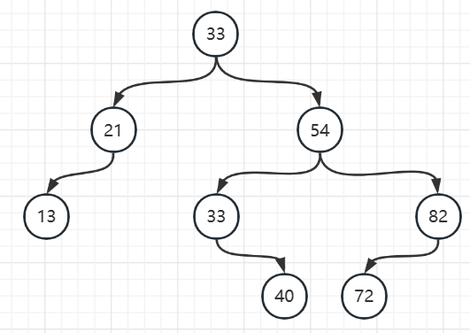

# HW2

PB20111689 蓝俊玮

## Ex 6.3

> 给定序列 $(33,21,13,54,82,33,40,72)$ 和 $8$ 个处理器，试按照算法 $6.2$ 构造一棵为在 PRAM-CRCW 模型上执行快排序所用的二叉树

开始时所有处理器均将它们的处理器号写入变量 `root`，但根据 CRCW 模型原理，最终只有一个处理器号会被写入变量 `root`。则假设第一个数 $33$ 为 `root`。则可以构造出如下二叉树：



首先是将 `root` 设置为 $1$，此时根的主元就是 $33$，然后在并发写操作中，只有两个只能被当前根 $f_i$ 选择（注意这里的根 $f_i$ 不一定是 `root`，而是在每轮迭代时当前的根），即只有 $LC_{f_i}$ 和 $RC_{f_i}$ 会被写入，它们会记录当前根 $f_i$ 的左右子树的主元。那么此时由条件 $(A_i<A_{f_i})\bigvee(A_i=A_{f_i}\bigwedge i<f_i)$ 可以知道，主元 $33$ 会将其划分为：$[21,13]$ 和 $[54,82,33,40,72]$。

对于 $[21,13]$ 来说，还是假设第一个数 $21$ 竞争到了，则此时 $LC_{1}=2$（在这里 $f_i=1$ 而 $i=2$，而此时由于 $i=3$ 时没有竞争到，此时也就不满足 $i=LC_{f_i}=LC_1=2$，所以会执行代码当中的 $f_i=LC_{f_i}\to f_3=LC_1=2$，即此时会将 $21$ 作为 $13$ 的父亲节点，然后开始下一轮迭代。

而对于 $[54,82,33,40,72]$ 来说，还是假设第一个数 $54$ 竞争到了 $RC_{f_i}$ 的写权力，同理它会继续划分出来 $[33,40]$ 和 $[82,72]$，接着继续迭代直到所有主元被选取完。因此最后便可以得到上述结果。

最后算法得到的变量为：

| 处理器 i |  1   |  2   |  3   |  4   |  5   |  6   |  7   |  8   |
| :------: | :--: | :--: | :--: | :--: | :--: | :--: | :--: | :--: |
|   root   |  1   |  -   |  -   |  -   |  -   |  -   |  -   |  -   |
|  $f_i$   |  1   |  1   |  2   |  1   |  4   |  4   |  6   |  5   |
|  $LC_i$  |  2   |  3   |  -   |  6   |  8   |  -   |  -   |  -   |
|  $RC_i$  |  4   |  -   |  -   |  5   |  -   |  7   |  -   |  -   |

## T2

> 如何实现算法 $6.2$ 所构造二叉排序树并行地转化为有序数组，写出实现的并行算法，其时间复杂度和并行计算模型各是什么？

确定一个二叉树的有序序列，一般可以通过中序遍历获得，但是中序遍历一般是递归形式的，难以实现并行。根据算法导论中的顺序统计数的知识，可以采用顺序统计数的方式来转化。所以我们需要计算每个节点对应的子树的大小。

```python
for i=1 to n par-do					// O(1)
	size[i] = 0
	rank[i] = -1

for i=1 to n par-do					// O(1)
	if LC[i] then
		parent[LC[i]] = i
	if RC[i] then
		parent[RC[i]] = i

for k=1 to log(n)+1 do				// O(log(n))
	for Pi in level k par-do
		level[Pi] = k

for k=log(n)+1 to 1 do				// O(log(n))
	for Pi in level k par-do
		size[i] = size[LC[i]] + size[RC[i]] + 1

for i=1 to n par-do					// O(log(n))
	rank[i] = size[LC[i]] + 1
	j = i
	while j != root do
		if A[j] < A[i] then
			rank[i] = rank[i] + size[LC[j]] + 1
		j = parent[j]

for i=1 to n par-do					// O(1)
	array[rank[i]] = A[i]
	
return array
```

根据顺序统计树的要求，我们需要计算每个节点对应的子树的大小，把它记录到 `size[i]` 当中。而我们知道同一层的树节点的树大小是可以并行计算的，因为兄弟节点之间是没有依赖关系的，所以计算 `size[i]` 是需要 $O(\log n)$ 的。而最后并行地对每一个节点调用 `SELECT` 算法，这里由于需要遍历树，而树的高度是 $O(\log n)$ 的，因此 `SELECT` 这部分的算法需要 $O(\log n)$，至于 `SELECT` 算法就不阐述了，在算法导论中有详细解释。所以总的算法为 $O(\log n)$，并行计算模型为 PRAM-CRCW 模型，因为我们需要进行并发读和并发写操作。