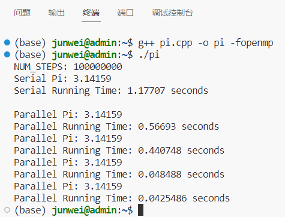
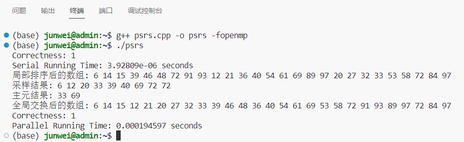
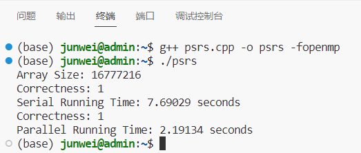
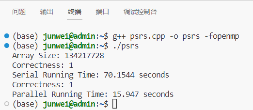

# Lab1 实验报告

PB20111689 蓝俊玮

[TOC]

## 1. 实验环境以及配置

本次实验在我的服务器上进行：

- 操作系统：Ubuntu 18.04.6 LTS
- 处理器：Intel(R) Xeon(R) Gold 6154 CPU @ 3.00GHz
- OpenMP：_OPENMP 201511 (4.5)

## 2. 实验设计

### 2.1 计算 $\pi$ 值

#### 2.1.1 并行域并行化

采用并行域并行化实现 $\pi$ 值的计算。每个进程处理相隔为 `NUM_THREADS` 的数据, 最后串行地将每个线程得到的 `sum` 求和。

```cpp
double parallelPi1() {
	double pi = 0.0, sum[NUM_THREADS] = { 0.0 };
	double step = 1.0 / NUM_STEPS;

	omp_set_num_threads(NUM_THREADS);
	#pragma omp parallel num_threads(NUM_THREADS) shared(sum)
	{
		double x;
		int tid = omp_get_thread_num();
		for (int i = 0; i < NUM_STEPS; i += NUM_THREADS) {
			x = (i + 0.5) * step;
			sum[tid] += 4.0 / (1.0 + x * x);
		}
	}
	for (int i = 0; i < NUM_THREADS; i++) {
		pi += step * sum[i];
	}
	return pi;
}
```

#### 2.1.2 共享任务结构并行化

利用 `#pragma omp for` 自动划分 `for` 循环，最后串行地将每个线程得到的 `sum` 求和。

```cpp
double parallelPi2() {
	double pi = 0.0, sum[NUM_THREADS] = { 0.0 };
	double step = 1.0 / NUM_STEPS;

	omp_set_num_threads(NUM_THREADS);
	#pragma omp parallel num_threads(NUM_THREADS) shared(sum)
	{
		double x;
		int tid = omp_get_thread_num();
		#pragma omp for
		for (int i = 0; i < NUM_STEPS; i++) {
			x = (i + 0.5) * step;
			sum[tid] += 4.0 / (1.0 + x * x);
		}
	}
	for (int i = 0; i < NUM_THREADS; i++) {
		pi += step * sum[i];
	}
	return pi;
}
```

#### 2.1.3 临界区并行化

利用 `#pragma omp critical` 让各个线程竞争临界区，然后再直接加入 `sum`，这样就可以不再使用串行的求和方法了。通过临界区的使用，可以增加每个线程的工作量，能减少线程切换带来的开销占比。

```cpp
double parallelPi3() {
	double pi = 0.0, x = 0.0, sum = 0.0;
	double step = 1.0 / NUM_STEPS;

	omp_set_num_threads(NUM_THREADS);
	#pragma omp parallel num_threads(NUM_THREADS) private(x, sum)
	{
		int tid = omp_get_thread_num();
		sum = 0.0;
		for (int i = tid; i < NUM_STEPS; i += NUM_THREADS) {
			x = (i + 0.5) * step;
			sum += 4.0 / (1.0 + x * x);
		}
		#pragma omp critical
			pi += sum * step;
	}
	return pi;
}
```

**在 PPT 中的该示例是有问题的**，因为在 PPT 示例中将 `int i;` 声明在 `#pragma omp parallel` 之外，并且在声明线程私有时并没有设置 `private(i)`，这时候 OpenMP 会默认设置其为共享的数据 `shared(i)`。那么在计算的时候，就会出现同步写的问题，所有线程都会对 `i` 进行修改，这样必然会出现问题。因此我们需要设置 `int i` 为私有的，因此可以将其声明在  `#pragma omp parallel` 之内以达到目的。

#### 2.1.4 规约并行化

通过 `reduction(+:sum)` 来直接规约求和 `sum`，规约求和通过分组并行的方式，可以增加计算速度。

```cpp
double parallelPi4() {
	double pi = 0.0, x = 0.0, sum = 0.0;
	double step = 1.0 / NUM_STEPS;

	omp_set_num_threads(NUM_THREADS);
	#pragma omp parallel for reduction(+:sum) num_threads(NUM_THREADS) private(x)
	for (int i = 0; i < NUM_STEPS; i++) {
		x = (i + 0.5) * step;
		sum += 4.0 / (1.0 + x * x);
	}
	pi = step * sum;
	return pi;
}
```

### 2.2 PSRS 算法

#### 2.2.1 均匀划分与局部排序

首先根据我们待排序的数据集大小 `SIZE` 和线程数 `NUM_THREADS` 进行均匀划分。划分结束之后，计算得到每段的起始地址和结束地址，然后通过 `#pragma omp parallel` 的并行方式进行并行计算。然后在结束之后，需要使用同步路障，等待所有线程完成。

```cpp
// 均匀划分且局部排序
#pragma omp parallel num_threads(NUM_THREADS) shared(arr)
{
    int tid = omp_get_thread_num();
    int stride = SIZE / NUM_THREADS;
    int l = tid * stride, r = (tid + 1) * stride - 1;
    mergeSort(arr, l, r);
}
#pragma omp barrier
```

那么这一步的时间复杂度就是 $O(\frac{n}{p}\log\frac{n}{p})$。

#### 2.2.2 正则采样

同样的，首先我们需要通过线程号 `tid` 得知每个线程需要处理的起始位置和写入的位置。然后从起始位置开始，采样共 `SAMPLE_SIZE` 个数据。结束之后，需要使用同步路障，等待所有线程完成。

```cpp
// 正则采样
#pragma omp parallel num_threads(NUM_THREADS) shared(arr, samples) 
{
    int tid = omp_get_thread_num();
    // 记录不同处理器采样后放入的起始位置
    int thread_sample_index = tid * SAMPLE_SIZE;
    // 记录不同处理器采样前从arr中取出数据的位置
    int thread_arr_index = tid * SAMPLE_SIZE * stride;
    for (int i = 0; i < SAMPLE_SIZE; i++) {
        int sample_index = i + thread_sample_index;
        int arr_index = i * stride + thread_arr_index;
        samples[sample_index] = arr[arr_index];
    }
}
#pragma omp barrier
```

这一步的时间复杂度可以看作常数时间。

#### 2.2.3 采样排序与选择主元

在正则采样结束之后，需要通过串行的方式进行采样排序和选择主元。其中排序算法使用的是归并排序，同时选择主元的时候也是根据从采样大小 `SAMPLE_SIZE` 来计算位置，而主元只选择 `NUM_THREADS - 1` 个，从而将每段数据划分成 `NUM_THREADS` 段用于全局交换。

```cpp
// 采样排序
mergeSort(samples, 0, SAMPLE_SIZE * NUM_THREADS - 1);

// 选择主元
for (int i = 0; i < NUM_THREADS - 1; i++) {
    int pivot_index = (i + 1) * SAMPLE_SIZE;
    pivots[i] = samples[pivot_index];
}
```

这一步的时间复杂度也可以看作常数时间。

#### 2.2.4 主元划分与全局交换

由于每个线程内的数据以及排序好了，所以可以通过串行扫描的方式，将每个数据与主元进行比较，然后计算通过主元划分得到的每段的起始位置以及长度。在后面做了 MPI 时会发现，使用 `MPI_Alltoallv` 进行全局交换的时候就是需要每段的长度和写入的起始位置。

首先，我通过 `vector<int> partitions` 来记录主元划分时，每一段的起始位置和结束位置。首先需要初始化 `partitions`，其中 `partitions[0]` 定义为 `l - 1`，因为在我定义 `partitions` 的时候，是认为每一段的起始位置 `partitions` 是包含在内的，而结束位置是不包含在内的。因此 `l - 1` 是不包含在内的。并且将剩余的位置默认都是结尾 `r`。（因为可能出现后面几段的长度为 0 的情况）

然后定义了 `lens` 来记录每个线程内的划分出来的每一段的长度。

接着使用 `counts` 来记录全局交换后的每个处理器中应该处理的数组长度。即通过全局交换之后，每个线程内的数据长度为多少。

最后使用 `accumulate_counts` 来记录每个线程内的数据的起始地址。这个就是类似 `MPI_Alltoallv` 的数据写入的起始位置。

最后写入共享的数组 `arr_change`，然后需要使用同步路障，等待所有线程完成。

```cpp
/*
* arr_change用来存储全局交换后的数组
* lens记录每个处理器中划分之后的每段长度
* counts记录全局交换后的每个处理器中应该处理的数组长度
* accumulate_counts是counts的累计和，方便将arr中的数据交换到temp中，用作偏移地址
*/
vector<int> pivotPartition(vector<int> arr, vector<int> pivots, vector<int>& accumulate_counts) {
	// 主元划分
	vector<int> arr_change(SIZE);
	vector<vector<int> > lens(NUM_THREADS, vector<int>(NUM_THREADS));
	vector<int> counts(NUM_THREADS);
	#pragma omp parallel num_threads(NUM_THREADS) shared(arr, temp, lens, counts, accumulate_counts)
	{
		int tid = omp_get_thread_num();
		int stride = SIZE / NUM_THREADS;
		int l = tid * stride, r = (tid + 1) * stride - 1;
		vector<int> partitions(NUM_THREADS + 1);
		partitions[0] = l - 1;
		for (int i = 1; i < NUM_THREADS + 1; i++)
			partitions[i] = r;
		// 主元划分
		int ll = l;
		for (int i = 0; i < NUM_THREADS - 1; i++) {
			for (int j = ll; j <= r; j++) {
				if (arr[j] > pivots[i]) {
					partitions[i + 1] = j - 1;
					ll = j;
					break;
				}
			}
		}
		// 这一段程序的目的是为了计算交换后的地址索引，注意这一块需要同步路障
		lens[tid][NUM_THREADS - 1] = r - ll + 1;
		for (int i = 0; i < NUM_THREADS; i++) {
			lens[tid][i] = partitions[i + 1] - partitions[i];
		}
		#pragma omp barrier
		for (int i = 0; i < NUM_THREADS; i++) {
			counts[tid] += lens[i][tid];
		}
		#pragma omp barrier
		for (int i = 0; i <= tid; i++) {
			accumulate_counts[tid] += counts[i];
		}
		#pragma omp barrier
		// 这一段程序的目的是为了计算交换后的地址索引
		// 全局交换
		for (int i = 0; i < NUM_THREADS; i++) {
			int dest_index = (i == 0) ? 0 : accumulate_counts[i - 1];
			for (int ii = 0; ii < tid; ii++) {
				dest_index += lens[ii][i];
			}
			for (int j = partitions[i] + 1, k = 0; j <= partitions[i + 1]; j++, k++) {
				arr_change[dest_index + k] = arr[j];
			}
		}
	}
	return arr_change;
}
```

这一步的时间复杂度为 $O(\frac{n}{p})$。

#### 2.2.5 归并排序

最后通过 `accumulate_counts` 来确认每一段的起始位置和结束位置。然后使用 `#pragma omp parallel` 结构进行并行分段排序。

```cpp
// 归并排序
#pragma omp parallel num_threads(NUM_THREADS) shared(arr)
{
    int tid = omp_get_thread_num();
    int stride = SIZE / NUM_THREADS;
    int l = (tid == 0) ? 0 : accumulate_counts[tid - 1], r = accumulate_counts[tid] - 1;
    mergeSort(arr, l, r);
}
```

这一步的时间复杂度就是 $O(\frac{n}{p}\log\frac{n}{p})$。

## 3. 结果展示与性能测试

### 3.1 计算 $\pi$ 值



可以看出，第三种和第四种并行程序的方法要显著优于第一种和第二种方法。不难分析出，原因在于在第一种和第二种方法中，最后计算结果的时候还使用了一段串行程序：

```cpp
for (int i = 0; i < NUM_THREADS; i++) {
    pi += step * sum[i];
}
```

这一段计算是一段同步写的问题。在第一种和第二种方法中都采取了并行计算的方式。而在第三种方法是采取了临界区的方式来解决这段同步写的问题，而在第四种方法种采取了规约求和的方式来解决这段同步写的问题，规约求和通过两两求和的方式进行，其计算时间复杂度可以达到 $O(\log n)$，因此后面两种方法的计算速度会明显好于第一种和第二种方法。

### 3.2 PSRS 算法

首先详细展示 PSRS 算法中间每一步计算的结果，这里采用 PPT 的示例以示结果：



然后生成随机的数组，将数据规模和线程规模都增大，可以看到性能如下：





可以看到，通过 OpenMP 并行排序可以显著提升排序速度，加速比可以达到 4 倍左右 (16 线程)。

## 4. 总结

本次实验实际上并没有涉及太多复杂 OpenMP 编程的技巧或者特性，本次实验的终点还是在于并行算法的设计以及组织，从而实现这些并行算法，使得机器资源能够被充分利用。

