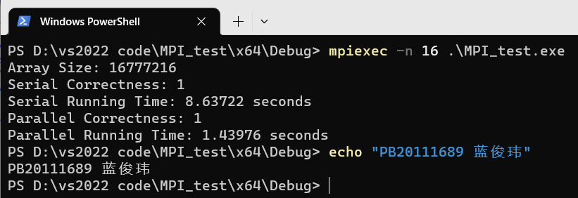
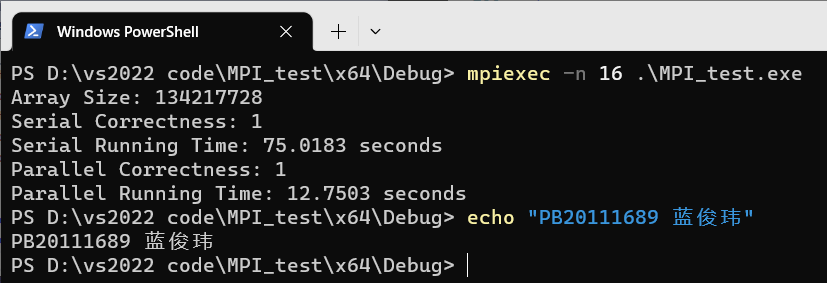
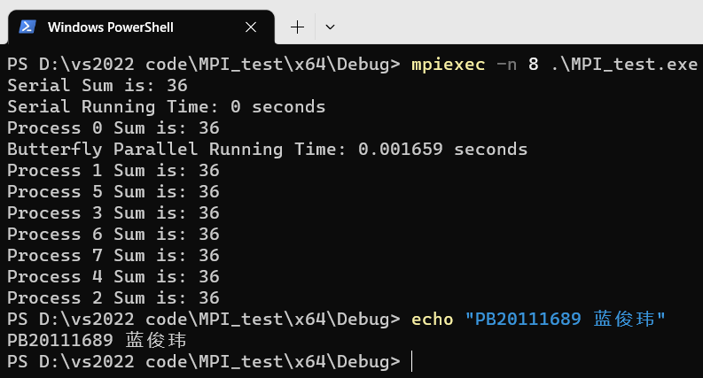
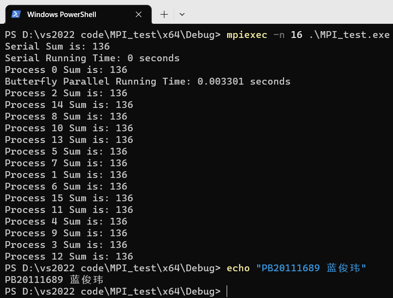
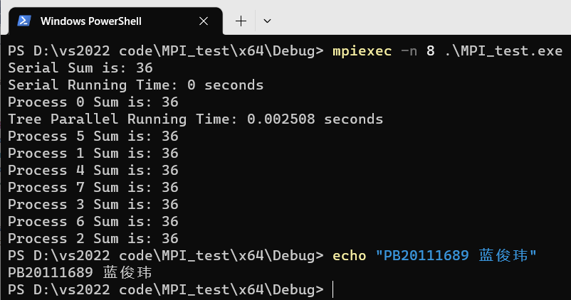

# Lab2 实验报告

PB20111689 蓝俊玮

[TOC]

## 1. 实验环境以及配置

本次实验在我的个人电脑上进行：

- 操作系统：Windows 10 家庭中文版 22H2
- 处理器：AMD Ryzen 7 4800H with Radeon Graphics 2.90 GHz
- IDE：Visual Studio 2022

## 2. 实验设计

### 2.1 PSRS 算法

#### 2.1.1 均匀划分与局部排序

首先我们在线程 0 生成数据，然后使用 `MPI_Scatter` 将进程 0 的数组均匀划分给每个进程。其中接收地址为 `task_arr`，接收的数据大小为均匀划分的大小 `task_stride`。

```cpp
// 均匀划分
// 用散播的方式，将进程0的数组均匀划分给每个进程
MPI_Scatter(arr1, task_stride, MPI_INT, task_arr, task_stride, MPI_INT, 0, MPI_COMM_WORLD);
// 局部排序
mergeSort(task_arr, 0, task_stride - 1);
```

#### 2.1.2 正则采样

这里与 OpenMP 不一样的是，由于我们不再使用共享内存，因此每个线程都拥有自己的私有的数据，所以我们不再需要计算线程需要处理的起始地址。在正则采样结束之后，我们需要使用同步路障，等待所有线程完成。

```cpp
// 正则采样
for (int i = 0; i < SAMPLE_SIZE; i++) {
    int arr_index = i * sample_stride;
    task_sample[i] = task_arr[arr_index];
}
MPI_Barrier(MPI_COMM_WORLD);
```

#### 2.1.3 采样排序与选择主元

在正则采样结束之后，需要通过串行的方式进行采样排序和选择主元，所以选择使用线程 0 进行串行执行。其中排序算法使用的是归并排序，最后也需要使用同步路障，等待线程 0 执行完成。然后将 0 号进程选择出来的主元广播给其它所有进程，以便于所有进程进行主元划分操作。

```cpp
// 进程0收集所有进程采样得到的数据，然后在进程0内做串行的采样排序
MPI_Gather(task_sample, SAMPLE_SIZE, MPI_INT, samples, SAMPLE_SIZE, MPI_INT, 0, MPI_COMM_WORLD);
if (taskid == 0) {
    // 采样排序
    mergeSort(samples, 0, SAMPLE_SIZE * THREADS_NUM - 1);
    // 选择主元
    for (int i = 0; i < THREADS_NUM - 1; i++) {
        int pivot_index = (i + 1) * SAMPLE_SIZE;
        pivots[i] = samples[pivot_index];
    }
}
MPI_Barrier(MPI_COMM_WORLD);	// 等待0号进程选择主元
// 选择主元, 广播给所有进程
MPI_Bcast(pivots, THREADS_NUM - 1, MPI_INT, 0, MPI_COMM_WORLD);
```

#### 2.1.4 主元划分

在使用全局交换函数 `MPI_Alltoallv` 的时候，我们需要知道发送方的发送长度，因此需要使用 `part_len` 来记录主元划分之后每段的长度，并且使用 `part_start_index` 来记录每一段的起始位置。

```cpp
// 主元划分
// part_start_index 记录当前进程内，每个主元划分后的起始地址
int *part_start_index = new int[THREADS_NUM];
// part_len 记录每个主元划分后的长度
int *part_len = new int[THREADS_NUM];
int index = 0;
for (int i = 0; i < THREADS_NUM - 1; i++) {
    part_start_index[i] = index;
    part_len[i] = 0;
    while ((index < task_stride) && (task_arr[index] <= pivots[i])) {
        index++;
        part_len[i]++;
    }
}
part_start_index[THREADS_NUM - 1] = index;
part_len[THREADS_NUM - 1] = task_stride - index;
```

通过线性扫描一遍的方式，可以将数据划分出来，然后便可以计算出这些值。

#### 2.1.5 全局交换

因为我们需要计算出接收方该有的数据长度以及起始地址。因此我们需要从其它线程中获取长度信息，从而计算出全局交换之后，每个线程中所拥有的数据长度。

首先是通过 `MPI_Alltoall` 将每个线程中相应段的长度发送到相应的线程中，由于只发送一个长度数据，所以发送大小是 1，并且将从其它其它线程中接收到的长度记录在 `recv_part_len` 当中。

在有了其它线程发送过来的数据大小 `part_len` 之后，就可以计算出全局交换之后，在当前线程中的数据长度 `recv_len` 为多少。而每段数据接收的起始位置为正是前面所有段的数据的长度之和。

最后通过全局交换函数 `MPI_Alltoallv` 函数，将交换后从其它线程中得到的数据记为 `recv_task_arr`。

```cpp
// 全局交换
// 将所有数据都进行交换
// recv_part_len 用来接收交换后数组的每个部分的长度
int *recv_part_len = new int[THREADS_NUM];
MPI_Alltoall(part_len, 1, MPI_INT, recv_part_len, 1, MPI_INT, MPI_COMM_WORLD);
// 记录每个部分的起始位置
int *recv_start_index = new int[THREADS_NUM];
int recv_len = 0;
for (int i = 0; i < THREADS_NUM; i++) {
    recv_start_index[i] = recv_len;
    recv_len += recv_part_len[i];
}
// 全局交换
int *recv_task_arr = new int[recv_len];
MPI_Alltoallv(task_arr, part_len, part_start_index, MPI_INT, recv_task_arr, recv_part_len, recv_start_index, MPI_INT, MPI_COMM_WORLD);
```

#### 2.1.6 归并排序

在获得了 `recv_task_arr` 之后，便可以进行归并排序。

```cpp
// 归并排序
mergeSort(recv_task_arr, 0, recv_len - 1);
```

在每个线程归并排序结束之后，由于所有线程中的已经有序数据是分开的，因此我们需要将这些有序数据再收集起来。同理，需要知道每个部分的长度和起始偏移位置。

```cpp
// 同理，需要知道每个部分的长度和起始偏移位置
int *lens = new int[THREADS_NUM];
MPI_Alltoall(&recv_len, 1, MPI_INT, lens, 1, MPI_INT, MPI_COMM_WORLD);
int *len_index = new int[THREADS_NUM];
int len = 0;
for (int i = 0; i < THREADS_NUM; i++) {
    len_index[i] = len;
    len += lens[i];
}
```

最后，让 0 号线程收集这些有序数组，整个并行算法就结束了。

```cpp
// 0号进程收集，保存到sorted_arr中
MPI_Gatherv(recv_task_arr, recv_len, MPI_INT, sorted_arr, lens, len_index, MPI_INT, 0, MPI_COMM_WORLD);
```

### 2.2 蝶式全和

因为使用的是 N 个进程求 N 个数的全和，所以我们需要将数组中的数分散的各个进程中。这里使用 `MPI_Scatter` 将数据发送到各个进程中。

```cpp
int recv_arr;
MPI_Scatter(arr, 1, MPI_INT, &recv_arr, 1, MPI_INT, 0, MPI_COMM_WORLD);
```

然后从蝶式全和的示意图中，我们可以得知这个操作是 $O(\log N)$ 的。在每一层当中，可以得知每一层的操作都是可以并行执行的，在每一层执行完之后，才会开始下一层的操作。因此在每一层执行完之后，需要使用同步路障，等待所有线程完成。

可以看到，在第 0 层的时候，每个蝶式操作的步长为 2，而在第 1 层的时候，每个蝶式操作的步长为 4，所以可以知道，在第 $i$ 层的时候，每个蝶式操作的步长 `butterfly_step` 为 $2^{i+1}$。而在每个蝶式操作之中，在第 0 层的时候，是 0 和 1 配对，2 和 3 配对，步长为 1，而到了第 1 层的时候，可以发现是 0 和 2 配对，1 和 3 配对，步长为 2。所以可以知道，在第 $i$ 层的时候，每个配对操作的步长 `pair_step` 为 $2^{i}$。同时在同个结构下所需要进行每个蝶式操作次数也变为 $2^i$ 次。所以可以得到操作的结构如下：

```cpp
for (int h = 0; h < ceil(log2(threads_num)); h++) {
    int butterfly_step = pow(2, h + 1);
    int pair_step = pow(2, h);
    for (int start_id = 0; start_id < threads_num; start_id += butterfly_step) {
        for (int id = start_id; id < start_id + pair_step; id++) {
            // ......
        }
    }
    MPI_Barrier(MPI_COMM_WORLD);
}
```

在每一层内的操作，我们知道，每个进程都需要发送当前的局部和，也需要从配对的进程那里获取局部和。将从配对的进程那里获取的局部和加入到自己的局部和中。因此可以得到循环内的操作如下：

```cpp
int pair_id = id + pair_step;
if (pair_id >= threads_num) {
    break;
}
if (taskid == id) {
    int recv_sum;
    MPI_Status status;
    MPI_Send(&local_sum, 1, MPI_INT, pair_id, 0, MPI_COMM_WORLD);
    MPI_Recv(&recv_sum, 1, MPI_INT, pair_id, 0, MPI_COMM_WORLD, &status);
    local_sum += recv_sum;
}
if (taskid == pair_id) {
    int recv_sum;
    MPI_Status status;
    MPI_Send(&local_sum, 1, MPI_INT, id, 0, MPI_COMM_WORLD);
    MPI_Recv(&recv_sum, 1, MPI_INT, id, 0, MPI_COMM_WORLD, &status);
    local_sum += recv_sum;
}
```

### 2.3 二叉树全和

二叉树求全和的方式感觉是蝶式全和的一种简化形式。同理，在每一层当中，可以得知每一层的操作都是可以并行执行的，在每一层执行完之后，才会开始下一层的操作。因此在每一层执行完之后，需要使用同步路障，等待所有线程完成。

与之不同的是，现在不再是所有进程都需要进行发送和接收操作。在第 0 层的时候，接收的进程为 0，2等等，而发送的进程为 1，3等等。而到了第 1 层的时候，接收的进程为 0，4 等等，发送的进程为 2，6 等等。所以，与蝶式全和的定义类似，我们定义第 $i$ 层中二叉树之间的步长 `tree_step` 为 $2^{i+1}$，第 $i$ 层中的左右子树步长 `child_step` 为 $2^i$。由于右子树的索引是要大左子树 `child_step` 的，因此通过右子树（发送进程）索引 `send_id` 减去 `child_step`，就可以得到左子树（接收进程）索引 `recv_id`。

```cpp
for (int h = 0; h < ceil(log2(threads_num)); h++) {
    int tree_step = pow(2, h + 1);
    int child_step = pow(2, h);
    for (int send_id = child_step; send_id < threads_num; send_id += tree_step) {
        int recv_id = send_id - child_step;
        if (taskid == send_id) {
            MPI_Send(&local_sum, 1, MPI_INT, recv_id, 0, MPI_COMM_WORLD);
        }

        if (taskid == recv_id) {
            int recv_sum;
            MPI_Status status;
            MPI_Recv(&recv_sum, 1, MPI_INT, send_id, 0, MPI_COMM_WORLD, &status);
            local_sum += recv_sum;
        }
    }
    MPI_Barrier(MPI_COMM_WORLD);
}
```

在最后计算结束之后，将进程 0 号的全和发送到其它所有进程，这里直接使用 `MPI_Bcast` 进行广播操作。毕竟不是前缀和，我认为这一步的 $\log n$ 操作是没有必要的，采用广播操作只需要 1 步操作。

```cpp
MPI_Bcast(&local_sum, 1, MPI_INT, 0, MPI_COMM_WORLD);
```

## 3. 结果展示与性能测试

### 3.1 PSRS 算法

在这里就不再详细展示 PPT 上的计算过程了。还是采用随机生成数组的方式进行测试：





在我配置相对更差的个人电脑上，MPI 运行的效果感觉是比 OpenMP 要好不少的。加速比可以达到 6 倍。MPI 实现起来的额外开销会比 OpenMP 小不少。

### 3.2 蝶式全和

设置 N 个进程的数据为 1 到 N，每个进程的数据为相应的进程号 + 1（例如 0 号进程的数据为 1）。下面是 8 个进程和 16 个进程的测试结果：





### 3.3 二叉树全和

设置 N 个进程的数据为 1 到 N，每个进程的数据为相应的进程号 + 1（例如 0 号进程的数据为 1）。下面是 8 个进程和 16 个进程的测试结果：




## 4. 总结

通过 MPI 的实验，可以感觉到这些并行算法的实现非常适用于 MPI 来实现，因为这些算法感觉都是基于消息传递模型而设计的，而 OpenMP 的有限并行功能并感觉不适合这些并行算法的实现。同时可以体会到 MPI 的编程实现要比 OpenMP 复杂不少，但其带来的性能优化也是很值得的。

