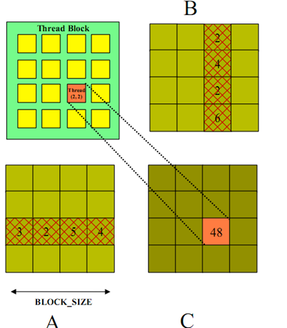
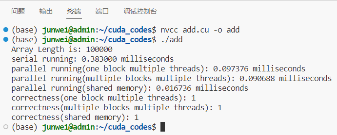
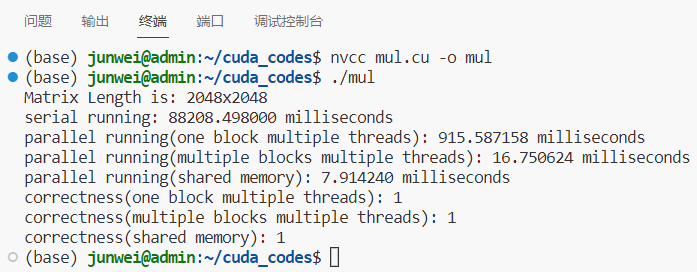

# Lab3 实验报告

PB20111689 蓝俊玮

[TOC]

## 1. 实验环境以及配置

本次实验在我的服务器上进行：

- 操作系统：Ubuntu 18.04.6 LTS
- 处理器：Intel(R) Xeon(R) Gold 6154 CPU @ 3.00GHz
- GPU：NVIDIA GeForce RTX 2080 Ti
- Cuda：11.6

```
Device Name: NVIDIA GeForce RTX 2080 Ti
totalGlobalMem: 11020 MBytes---11554848768 Bytes
sharedMemPerBlock: 49152
regsPerBolck: 65536
warpSize: 32
memPitch: 2147483647
maxTreadsPerBlock: 1024
maxThreadsDim[0-2]: 1024 1024 64
maxGridSize[0-2]: 2147483647 65535 65535
totalConstMem: 65536
major.minor: 7.5
clockRate: 1545000
textureAlignment: 512
deviceOverlap: 1
multiProcessorCount: 68
```

## 2. 实验设计

### 2.1 向量加法

#### 2.1.1 单块多线程

设定只使用一个线程块，并且将线程组织成一维的，这时便可以通过 `threadIdx.x` 来索引，其步长为线程的总数量 `blockDim.x` 。

```cpp
__global__ void vector_add1(float *out, float *a, float *b, int n) {
    int tid = threadIdx.x;
    int stride = blockDim.x;
    for (int i = tid; i < n; i += stride)
    {
        out[i] = a[i] + b[i];
    }
}
```

#### 2.1.2 多块多线程

只使用一个线程块并不能充分利用 GPU 的计算资源，因此将线程块设置成多个。这时候就需要使用 `blockIdx.x * blockDim.x + threadIdx.x` 来索引总的线程号。此时的步长为 `blockDim.x * gridDim.x`（即总的线程数）。

```cpp
__global__ void vector_add2(float *out, float *a, float *b, int n)  {
    int tid = blockIdx.x * blockDim.x + threadIdx.x;
    int stride = blockDim.x * gridDim.x;
    for (int i = tid; i < n; i += stride) {
        out[i] = a[i] + b[i];
    }
}
```

#### 2.1.3 共享内存

虽然感觉在这个问题中不需要使用共享内存来进行优化（因为没有出现重复访存的问题，每个数据只需要计算一次）。但是在实现共享内存方式之后，会发现程序性能有明显的提升。因为共享内存是在线程块内共享的，而在不同线程块之间是不共享的，因此在访问共享内存的时候需要使用线程索引 `threadIdx.x` 进行访问。下面采用的动态并行的方式，在所有线程将计算结果写入共享内存之后，然后再将结果保存到目标数组的。

```cpp
__global__ void vector_add3(float *out, float *a, float *b, int n) {
    __shared__ float temp[256];
    int tid = threadIdx.x;
    int stride = blockDim.x * gridDim.x;
    for (int i = blockIdx.x * blockDim.x + threadIdx.x; i < n; i+= stride) {
        temp[tid] = a[i] + b[i];
        __syncthreads(); 
        out[i] = temp[tid];
    }
}
```

### 2.2 矩阵乘法

#### 2.2.1 单块多线程

设定只使用一个线程块，并且将线程组织成二维的，这时便可以通过 `threadIdx.x` 和 `threadIdx.y` 来分别索引列和行方向上的数据，其步长分别为线程的总数量 `blockDim.x` 和 `blockDim.y`。

```cpp
__global__ void matrix_mul1(float *out, float *a, float *b, int n) {
    int tid_x = threadIdx.x;
    int tid_y = threadIdx.y;
    for (int i = tid_y; i < n; i += blockDim.y) {
        for (int j = tid_x; j < n; j += blockDim.x) {
            float sum = 0.0;
            for (int k = 0; k < n; k++) {
                sum += a[i * n + k] * b[k * n + j];
            }
            out[i * n + j] = sum;
        }
    }
}
```

#### 2.2.2 多块多线程

同样的，只是将索引号和步长进行了拓展。

```cpp
__global__ void matrix_mul2(float *out, float *a, float *b, int n) {
    int tid_x = threadIdx.x;
    int tid_y = threadIdx.y;
    int bid_x = blockIdx.x;
    int bid_y = blockIdx.y;
    int x = bid_x * blockDim.x + tid_x;
    int y = bid_y * blockDim.y + tid_y;
    int stride_x = blockDim.x * gridDim.x;
    int stride_y = blockDim.y * gridDim.y;
    for (int i = y; i < n; i += stride_y) {
        for (int j = x; j < n; j += stride_x) {
            float sum = 0.0;
            for (int k = 0; k < n; k++) {
                sum += a[i * n + k] * b[k * n + j];
            }
            out[i * n + j] = sum;
        }
    }
}
```

#### 2.2.3 共享内存

因为矩阵乘法中有大量的重复访存操作，因为我们可以使用共享内存来存储矩阵，这样可以减少 gpu 中全局内存的访问次数。同时使用共享内存后，缓存不命中和替换次数也会相应地减少。

因为在并行的过程中，实际上我们的程序是通过对矩阵分块进行计算的。分块计算的好处就是内存的排布是连续的，对于缓存也是友好的。因此我们的共享内存也采取分块的形式进行存储。为了减少重复访存次数，我们分别定义了 `temp_a` 和 `temp_b` 共享内存来存储矩阵 `a` 和 `b`。由于共享内存是块内共享的，在不同块之间是不共享的，因此我们在存储 `a` 和 `b` 的时候需要将其全局的地址存储到块内的地址。

因此在存储之前，首先我们要计算出 `a` 和 `b` 的存储位置 `offset_a` 和 `offset_b`。然后将对应的数据复制到共享内存数组中。具体来说，每个线程从矩阵 `a` 和 `b` 中读取一个元素，然后将其存储到 `temp_a` 和 `temp_b` 数组中。当所有线程都完成了数据加载之后，调用 `__syncthreads()` 函数，等待所有线程都完成了数据加载操作，确保共享内存中的数据已经全部被加载。



从这个示意图中，我们可以得知，对于每一个线程来说，其都要获取它这个位置上行列方向的所有块的数据。即位于 (2, 2) 的线程，它需要获取 `a` 中第 2 行所有块的数据，同时也需要获取 `b` 中第 2 行所有块的数据。所以要计算出 `offset_a` 的起始位置为数组 `a` 相应行的起始位置。所以明显需要根据 `bid_y` 来确认其位置。所以可以分析出，对于其每个块的起始位置为 `(bid_y * blockDim.x) * n + block * blockDim.x`，它是 `bid_y` 不变的。（注意矩阵是一维形式排布的，所以需要乘 n）同理可知，`offset_b` 的起始位置为 `block * blockDim.x * n + bid_x * blockDim.x`，它是 `bid_x` 恒定的。

接着我们按分块计算的操作，计算每个块中的值，将其加到 `temp_f` 中。当所有线程都完成了计算之后，调用 `__syncthreads()` 函数，等待所有线程都完成了计算操作，确保共享内存中的数据已经全部被使用。(注意这个分块计算十分重要，如果不通过分块计算的话，实际上该算法是不能读取完整的行列信息。它只能读取到 1 个块中的行列信息，即只有 32x32 的信息，是不可能实现完整的矩阵乘法操作)

当然这种实现方式和数据集的大小有很大关系，需要按照数据集的大小来设置 blockSize 和 gridSize，以及共享内存的大小与读取。

```cpp
__global__ void matrix_mul3(float *out, float *a, float *b, int n) {
    __shared__ float temp_a[32][32];
    __shared__ float temp_b[32][32];
    int tid_x = threadIdx.x;
    int tid_y = threadIdx.y;
    int bid_x = blockIdx.x;
    int bid_y = blockIdx.y;
    int x = bid_x * blockDim.x + tid_x;
    int y = bid_y * blockDim.y + tid_y;
    float temp_f = 0.0;
    for (int block = 0; block < n / 32; block++) {
        int offset_a = bid_y * blockDim.x * n + block * blockDim.x;
        int offset_b = block * blockDim.x * n + bid_x * blockDim.x;
        temp_a[tid_y][tid_x] = a[offset_a + tid_y * n + tid_x];
        temp_b[tid_y][tid_x] = b[offset_b + tid_y * n + tid_x];
        __syncthreads();
        for (int k = 0; k < 32; k++) {
            temp_f += temp_a[tid_y][k] * temp_b[k][tid_x];
        }
        __syncthreads();
    }
    out[y * n + x] = temp_f;
}
```

## 3. 性能测试

### 3.1 向量加法

首先展示一下数组规模为 10W 时的运行结果：



剩下的采用表格的方式记录下来（时间单位为毫秒）：

| 数组规模 | 串行程序 | 单线程块 |  加速比   | 多线程块 |  加速比   | 共享内存 |   加速比   |
| :------: | :------: | :------: | :-------: | :------: | :-------: | :------: | :--------: |
|   10W    | 0.383000 | 0.097376 | **3.933** | 0.090688 | **4.223** | 0.016736 | **22.885** |
|   20W    | 0.763000 | 0.174688 | **4.368** | 0.168832 | **4.519** | 0.024576 | **31.047** |
|   100W   | 7.352000 | 1.378560 | **5.333** | 1.332640 | **5.517** | 0.132192 | **55.616** |
|   200W   | 29.41600 | 2.749248 | **10.70** | 2.646368 | **11.12** | 0.250176 | **117.58** |
|  1000W   | 179.1210 | 13.69526 | **13.08** | 13.16045 | **13.61** | 1.202880 | **148.91** |
|  2000W   | 376.7890 | 27.43933 | **13.73** | 26.30039 | **14.33** | 2.387584 | **157.81** |

其中单线程块的设置为 256 线程，多线程块的设置为 16 线程块 256 线程，共享内存的设置也是 16 线程块 256 线程。

可以明显的看到，随着数据规模的不断增加，各个并行程序的加速比也在逐步变大。其中共享内存的加速效果十分明显。但是多线程块的效果提升不是很明显，原因是该问题本身就不需要过于复杂的线程组织方式，如果采用多个线程块的话，则必然会增加一些开销操作。

### 3.2 矩阵乘法

首先展示一下矩阵大小为 2048x2048 时的运行结果：



接着再进行不同矩阵规模的测试，并且记录成表格（时间单位为毫秒）：

| 矩阵规模 | 串行程序 | 单线程块 |  加速比   | 多线程块 |   加速比    | 共享内存 |    加速比    |
| :------: | :------: | :------: | :-------: | :------: | :---------: | :------: | :----------: |
|   2048   | 88208.50 | 915.5871 | **96.34** | 16.75062 | **5265.98** | 7.914240 | **11145.54** |
|   1024   | 7824.400 | 110.6394 | **70.72** | 2.557952 | **3058.85** | 1.397664 | **5598.20**  |
|   512    | 576.1470 | 14.46778 | **39.82** | 0.337920 | **1704.98** | 0.189120 | **3046.46**  |
|   256    | 57.12100 | 1.965312 | **29.06** | 0.053248 | **1072.74** | 0.032896 | **1736.41**  |

其中单线程块的设置为 16x16 线程，多线程块的设置为 16x16 线程块 16x16 线程，共享内存的设置为 32x32 线程，线程块数量需要根据数据规模进行调整。毕竟共享内存的使用需要充分考虑数据规模大小，必须要满足所有线程都能够覆盖矩阵，所以开固定的线程块数量是不行的。即需要设置成 `gridSize = dim3(LENGTH / 32, LENGTH / 32);`

在当前我服务器上的 GPU 配置来看：

```
maxThreadsDim[0-2]: 1024 1024 64
maxGridSize[0-2]: 2147483647 65535 65535
```

GridSize 最多只能开到 65536x65536，则能够进行并行的数据规模最大为：2097152x2097152。

可以明显的看到，随着数据规模的不断增加，各个并行程序的加速比也在逐步变大。其中共享内存的加速效果十分明显。由于矩阵乘法本身就很适合分块进行，因为可以很好的利用空间局部性来减少缓存不命中的次数，所以通过组织线程块的排布为二维形式，可以将数据和线程紧密地联系起来，因此加速效果也是十分明显。

## 4. 实验总结

本次实验设计主要是围绕向量加法和矩阵乘法的并行计算展开的，目的是熟悉 CUDA 编程中的线程块和线程的组织方式，并且了解如何使用共享内存来减少全局内存的访问次数。同时还可以通过实验调整线程块和线程的数量，优化程序的性能。

在向量加法中，我们使用了单块多线程和多块多线程两种方式，以及共享内存的方式。通过实验可以发现，使用共享内存确实可以提高程序的性能。在矩阵乘法中，我们同样使用了单块多线程和多块多线程两种方式，以及共享内存的方式。在矩阵乘法中，由于存在大量的重复访存操作，因此使用共享内存来存储矩阵并进行计算可以显著提高程序的性能。此外，分块计算也是矩阵乘法中很关键的一个优化策略。

总而言之，这个实验设计可以帮助学生深入理解 CUDA 编程的基本概念和技术，并且通过实际操作来掌握并行计算的优化策略。