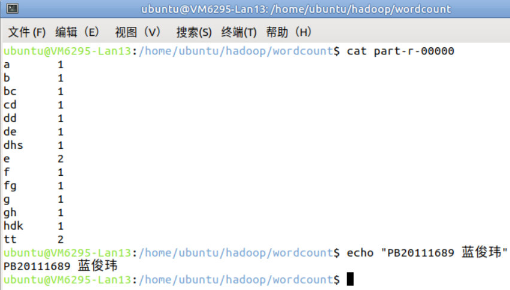
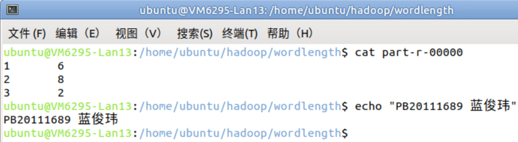

# Lab4 实验报告

PB20111689 蓝俊玮

[TOC]

## 1. 实验环境

本次实验在学校提供的虚拟机平台 vlab 上进行：

- 操作系统：Ubuntu 20.04.3 LTS
- jdk：1.8.0_371
- hadoop：1.0.4

## 2. 实验步骤

### 2.1 安装 jdk

在 [Java Downloads | Oracle](https://www.oracle.com/java/technologies/downloads/#java8) 选择 [jdk-8u371-linux-x64.tar.gz](https://www.oracle.com/java/technologies/downloads/#license-lightbox) 进行下载。下载结束后解压：

```bash
tar -zxvf jdk-8u371-linux-x64.tar.gz
```

然后在 `~/.bashrc` 中写入：

```bash
export JAVA_HOME=~/jdk1.8.0_371
export PATH=$JAVA_HOME/bin:$PATH
```

然后让其生效

```bash
source ~/.bashrc
```

通过 `java -version` 就可以判断是否安装成功。

### 2.2 验证并安装 ssh

首先检查是否安装了 ssh

```bash
which ssh
which sshd
which ssh-keygen
```

如果提示没有安装或者无任何内容显示，执行如下命令安装 ssh

```bash
sudo apt-get install openssh-client
sudo apt-get install openssh-server
```

通过下面的指令可以检测 sshd 服务是否启动：

```bash
ps aux | grep sshd
```

结果中若显示 sshd (注意显示 grep sshd 不算)，则 sshd 服务成功启动，否则执行如下命令启动 sshd 服务

```bash
sudo /etc/init.d/ssh start
```

### 2.3 生成 ssh 密钥对

生成 ssh 公钥

```bash
ssh-keygen -t rsa
```

待输入的地方全部回车选择默认
执行完毕后，会在 `~/.ssh/` 下面生成私钥 `id_rsa`，公钥为 `id_rsa.pub`

将公钥添加到 `authorized_keys` 中，这样可以实现免密登录

```bash
cat ~/.ssh/id_rsa.pub >> ~/.ssh/authorized_keys
chmod 600 ~/.ssh/authorized_keys
```

检测公钥是否配置完成：

```bash
ssh localhost
```

如果配置成功，则不需要密码就可以通过 ssh 进入 localhost。

### 2.4 安装 hadoop

在用户主目录下建立 hadoop 文件夹：

```bash
mkdir hadoop
```

解压缩 `hadoop-1.0.4.tar.gz`

```bash
tar -zxvf hadoop-1.0.4.tar.gz hadoop
```

将 hadoop 路径写入 `~/.bashrc`

```bash
export HADOOP_HOME=~/hadoop/hadoop-1.0.4
export PATH=$HADOOP_HOME/bin:$PATH
```

然后让其生效

```bash
source ~/.bashrc
```

接着配置 `hadoop-env.sh`，修改 `~/hadoop/hadoop-1.0.4/conf/hadoop-env.sh`，在该文件最后一行添加 `JAVA_HOME` 的路径：

```bash
export JAVA_HOME=~/jdk1.8.0_371
```

### 2.5 配置单机模式

对 `conf` 目录下面的配置文件不做修改即为单机模式

### 2.6 配置伪分布模式

修改 `conf` 目录下的 `core-site.xml` 文件，修改内容如下：

```xml
<?xml version="1.0"?>
<?xml-stylesheet type="text/xsl" href="configuration.xsl"?>
<configuration>
    <property>
        <name>fs.default.name</name>
        <value>hdfs://localhost:9000</value>
    </property>
</configuration>
```

修改 `conf` 目录下的 `mapred-site.xml` 文件，修改内容如下：

```xml
<?xml version="1.0"?>
<?xml-stylesheet type="text/xsl" href="configuration.xsl"?>
<configuration>
    <property>
        <name>mapred.job.tracker</name>
        <value>localhost:9001</value>
    </property>
</configuration>
```

修改 `conf` 目录下的 `hdfs-site.xml` 文件，修改内容如下：

```xml
<?xml version="1.0"?>
<?xml-stylesheet type="text/xsl" href="configuration.xsl"?>
<configuration>
    <property>
        <name>dfs.replication</name>
        <value>1</value>
    </property>
</configuration>
```

### 2.7 初始化 HDFS

```bash
~/hadoop/hadoop-1.0.4/bin/hadoop namenode -format
```

请勿频繁初始化

### 2.8 启动 hadoop

```bash
~/hadoop/hadoop-1.0.4/bin/start-all.sh
```

### 2.9 检测 hadoop 是否成功启动

```bash
ubuntu@VM6295-Lan13:/home/ubuntu$ jps
169862 NameNode
170358 TaskTracker
185335 Jps
170218 JobTracker
170136 SecondaryNameNode
170013 DataNode
```

### 2.10 在 HDFS 中添加文件和目录

```bash
hadoop fs -mkdir /user/ubuntu/wordcount/input
hadoop fs -mkdir /user/ubuntu/wordlength/input
```

上面的命令本质上是递归创建的，但在有的版本上是不支持的，那么需要你依次执行如下命令：

```bash
hadoop fs -mkdir /user
hadoop fs -mkdir /user/ubuntu
hadoop fs -mkdir /user/ubuntu/wordcount
hadoop fs -mkdir /user/ubuntu/wordcount/input
```

将文本文件从本地目录上传到 HDFS 中：

```bash
hadoop fs -put input1.txt /user/ubuntu/wordcount/input
hadoop fs -put input2.txt /user/ubuntu/wordcount/input
hadoop fs -put input1.txt /user/ubuntu/wordlength/input
hadoop fs -put input2.txt /user/ubuntu/wordlength/input
```

查看文件上传是否成功：

```bash
hadoop fs -lsr /user/ubuntu/wordcount/input
hadoop fs -lsr /user/ubuntu/wordlength/input
```

### 2.11 编译 `WordCount.java` 和 `WordLength.java`

在 `~/hadoop` 目录下包含了程序 `WordCount.java`，下面执行这些命令：

```bash
mkdir wordcount
cp WordCount.java wordcount/
cd wordcount
mkdir classes
javac -classpath /home/ubuntu/hadoop/hadoop-1.0.4/hadoop-core-1.0.4.jar:/home/ubuntu/hadoop/hadoop-1.0.4/lib/commons-cli-1.2.jar -d classes/ WordCount.java
```

接着打包：

```bash
jar -cvf WordCount.jar -C classes/ .
```

打包的时候一定不能忘记了上面命令最后的点号

同样地，在 `~/hadoop` 目录下编写 `WordLength.java`（在后面介绍）。

接着执行这些命令：

```bash
mkdir wordlength
cp WordCount.java wordlength/
cd wordlength
mkdir classes
javac -classpath /home/ubuntu/hadoop/hadoop-1.0.4/hadoop-core-1.0.4.jar:/home/ubuntu/hadoop/hadoop-1.0.4/lib/commons-cli-1.2.jar -d classes/ WordLength.java
```

接着打包：

```bash
jar -cvf WordLength.jar -C classes/ .
```

打包的时候一定不能忘记了上面命令最后的点号

### 2.12 运行 Hadoop 作业

通过 `hadoop jar` 命令可以让程序在 Hadoop 中运行。

在  `~/hadoop/wordcount` 目录下：

```bash
hadoop jar WordCount.jar WordCount /user/ubuntu/wordcount/input   /user/ubuntu/wordcount/output
```

在  `~/hadoop/wordlength` 目录下：

```bash
hadoop jar WordLength.jar WordLength /user/ubuntu/wordlength/input   /user/ubuntu/wordlength/output
```

### 2.13 获得运行结果

查看 `WordCount` 程序的运行结果：

```bash
ubuntu@VM6295-Lan13:/home/ubuntu/hadoop/wordcount$ hadoop fs -ls /user/ubuntu/wordcount/output

Found 3 items
-rw-r--r--   1 ubuntu supergroup          0 2023-05-03 11:13 /user/ubuntu/wordcount/output/_SUCCESS
drwxr-xr-x   - ubuntu supergroup          0 2023-05-03 11:13 /user/ubuntu/wordcount/output/_logs
-rw-r--r--   1 ubuntu supergroup         67 2023-05-03 11:13 /user/ubuntu/wordcount/output/part-r-00000
```

将 `part-r-00000` 保存下来：

```bash
hadoop fs -get /user/ubuntu/wordcount/output/part-r-00000 ./
```

查看结果：



```bash
ubuntu@VM6295-Lan13:/home/ubuntu/hadoop/wordcount$ cat part-r-00000 
a	1
b	1
bc	1
cd	1
dd	1
de	1
dhs	1
e	2
f	1
fg	1
g	1
gh	1
hdk	1
tt	2
```

查看 `WordLength` 的运行结果：

```bash
ubuntu@VM6295-Lan13:/home/ubuntu/hadoop/wordlength$ hadoop fs -ls /user/ubuntu/wordlength/output
Found 3 items
-rw-r--r--   1 ubuntu supergroup          0 2023-05-03 15:38 /user/ubuntu/wordlength/output/_SUCCESS
drwxr-xr-x   - ubuntu supergroup          0 2023-05-03 15:38 /user/ubuntu/wordlength/output/_logs
-rw-r--r--   1 ubuntu supergroup         12 2023-05-03 15:38 /user/ubuntu/wordlength/output/part-r-00000
```

将 `part-r-00000` 保存下来：

```bash
hadoop fs -get /user/ubuntu/wordlength/output/part-r-00000 ./
```

查看结果：



```bash
ubuntu@VM6295-Lan13:/home/ubuntu/hadoop/wordlength$ cat part-r-00000 
1	6
2	8
3	2
```

### 2.14 关闭 hadoop 集群

```bash
ubuntu@VM6295-Lan13:/home/ubuntu$ stop-all.sh 
stopping jobtracker
localhost: stopping tasktracker
stopping namenode
localhost: stopping datanode
localhost: stopping secondarynamenode
```

## 3. `WordLength.java` 实现

### 3.1 `map` 函数

因为需要统计的对象从单词变成单词长度，所以需要将 `word` 修改成 `IntWritable` 类型。

同时在设置 `word` 的时候，使用单词长度 `itr.nextToken().length()` 来设置 `word`。

```java
public static class TokenizerMapper extends Mapper<Object, Text, IntWritable, IntWritable>{

	private final static IntWritable one = new IntWritable(1);
	private IntWritable word = new IntWritable();
      
	public void map(Object key, Text value, Context context) throws IOException, InterruptedException {
		StringTokenizer itr = new StringTokenizer(value.toString());
		while (itr.hasMoreTokens()) {
			word.set(itr.nextToken().length());
			context.write(word, one);
		}
	}
}
```

### 3.2 `reduce` 函数

由于设置的 key 值现在是 `IntWritable` 类型了，因此需要修改相应位置的数据类型，`Reducer` 中输入和输出的类型从 `Reducer<Text, IntWritable, Text, IntWritable>` 成了 `Reducer<IntWritable, IntWritable, IntWritable, IntWritable>`。

```java
public static class IntSumReducer extends Reducer<IntWritable, IntWritable, IntWritable, IntWritable> {
	private IntWritable result = new IntWritable();

	public void reduce(IntWritable key, Iterable<IntWritable> values, Context context) throws IOException, InterruptedException {
		int sum = 0;
		for (IntWritable val : values) {
			sum += val.get();
		}
		result.set(sum);
		context.write(key, result);
	}
}
```

### 3.3 `main` 函数

修改输出的值类型为 `job.setOutputKeyClass(IntWritable.class)`：

```java
public static void main(String[] args) throws Exception {
    Configuration conf = new Configuration();
    String[] otherArgs = new GenericOptionsParser(conf, args).getRemainingArgs();
    if (otherArgs.length != 2) {
		System.err.println("Usage: wordLength <in> <out>");
        System.exit(2);
    }
    Job job = new Job(conf, "word length");
    job.setJarByClass(WordLength.class);
    job.setMapperClass(TokenizerMapper.class);
    job.setCombinerClass(IntSumReducer.class);
    job.setReducerClass(IntSumReducer.class);
    job.setOutputKeyClass(IntWritable.class);
    job.setOutputValueClass(IntWritable.class);
    FileInputFormat.addInputPath(job, new Path(otherArgs[0]));
    FileOutputFormat.setOutputPath(job, new Path(otherArgs[1]));
    System.exit(job.waitForCompletion(true) ? 0 : 1);
}
```

## 4. 实验总结

经过上述步骤，本次实验成功安装和配置了 Hadoop，并且使用 Hadoop 框架实现了 MapReduce 程序。通过这次实验，我初步了解到了 Hadoop 的基本架构和 MapReduce 的运行原理，也学会了如何在 Ubuntu 系统上安装和配置 Hadoop。此外，通过编写 MapReduce 程序，我初步理解了 MapReduce 的工作流程，并且学习了如何使用 Java 编写 MapReduce 程序，将程序打包成 JAR 文件，并在 Hadoop 中运行。